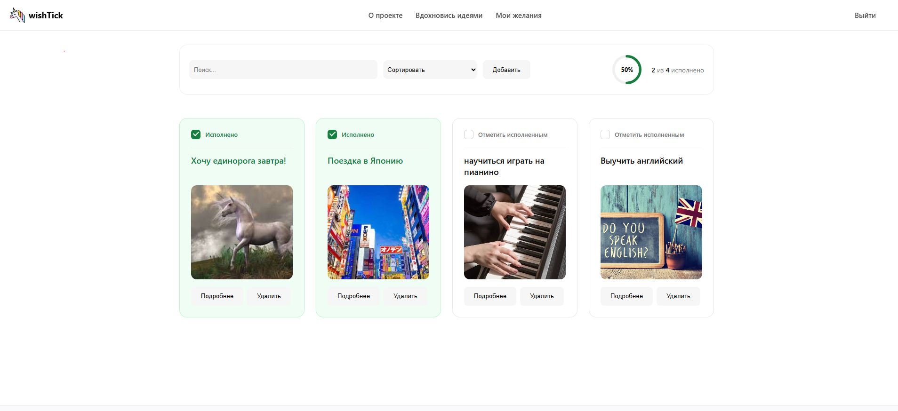

# ✨ WishTick

> Your digital wish journal that helps dreams come true.

**WishTick** is a web app for recording and tracking your wishes. Write down your dreams, mark them as fulfilled, and stay inspired by your own progress.

🔗 **Live Demo:** [wish-tick.vercel.app](https://wishtick.onrender.com/)

---

## 📖 About

In the fast pace of modern life, it's easy to lose sight of your dreams and goals. WishTick makes sure that doesn't happen:

- **Write down** — from small joys to big life goals
- **Track** — what's done and what's still in progress
- **Get inspired** — by your own achievements and progress

---

## ✨ Features

### Wishes
- ➕ Create wishes with title, description and image
- ✏️ Edit existing wishes
- 🗑️ Delete with confirmation toast
- ✅ Mark as "fulfilled" with green card highlight
- 🔍 Search by title
- 🔃 Sort by status

### Authentication
- 📝 Sign up with email confirmation
- 🔐 Sign in / sign out
- 🛡️ Protected routes
- ✉️ Dedicated "Verify your email" page

### Inspiration
- 🖼️ Random images from Unsplash
- 🎯 Click on image → create wish with prefilled image
- 🎨 Onboarding for new users with wish examples

### UX
- 🎉 Toasts for all actions (success / error)
- ⏳ Loaders and skeletons
- 📱 Responsive design
- 🌟 Animated empty state

---

## 🛠 Tech Stack

| Category | Technologies |
|----------|--------------|
| **Frontend** | React 19, TypeScript, Vite |
| **Routing** | React Router v7 |
| **State** | React Context, hooks |
| **Styling** | CSS Modules |
| **Animations** | Framer Motion, CSS animations |
| **UI** | Sonner (toasts) |
| **Backend** | Supabase (auth + Postgres) |
| **External API** | Unsplash API |
| **Tooling** | ESLint, Prettier, TypeScript strict |

---

**WishTick: Your dreams — under control!** ✨

